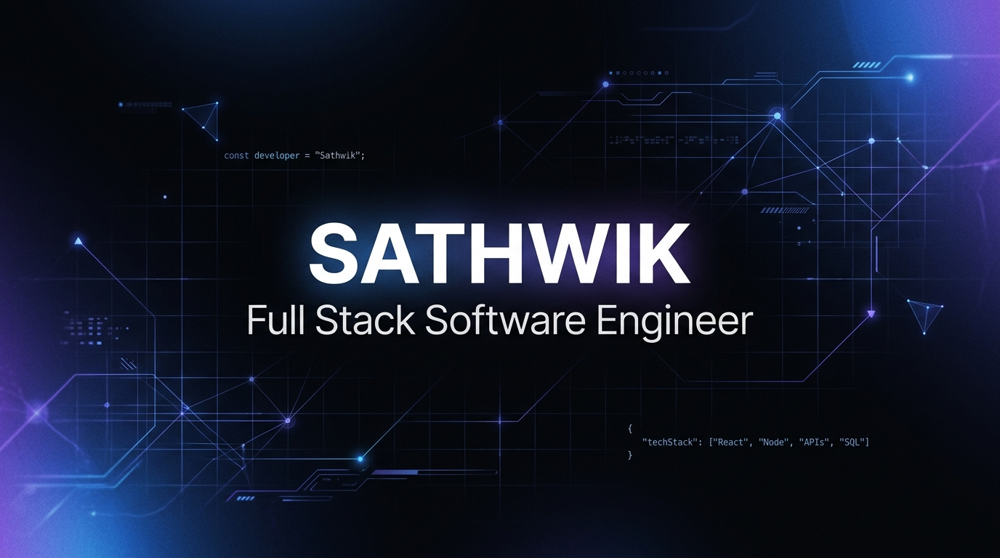
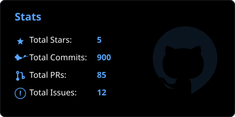
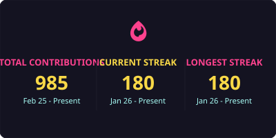
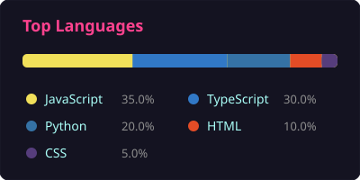

# Hi there, I'm Sathwik 👋

<!-- Waving Banner -->

  

<!-- Typing Animation -->

  

---

### 💫 About Me

- 🔭 I’m currently working on building dynamic, high-performance web applications.
- 🌱 I’m currently learning advanced cloud architecture and generative AI integrations.
- 👯 I’m looking to collaborate on interesting open-source projects.
- 💬 Ask me about **JavaScript, Python, React, or database optimization**.
- 📫 How to reach me: `sathvikov@gmail.com`

---

### 🛠️ Tech Stack & Tools

  

---

### 🏆 Achievements & Trophies (Static Badges)

  
  &nbsp;
  
  &nbsp;
  

  
  &nbsp;
  
  &nbsp;
  

---

### 📊 GitHub Stats & Contribution Streak

<table align="center">
  <tr>
    <td align="center" width="50%">
      
    </td>
    <td align="center" width="50%">
      
    </td>
  </tr>
</table>

  

---

### 🤝 Connect with Me

  
  &nbsp;&nbsp;
  

  

